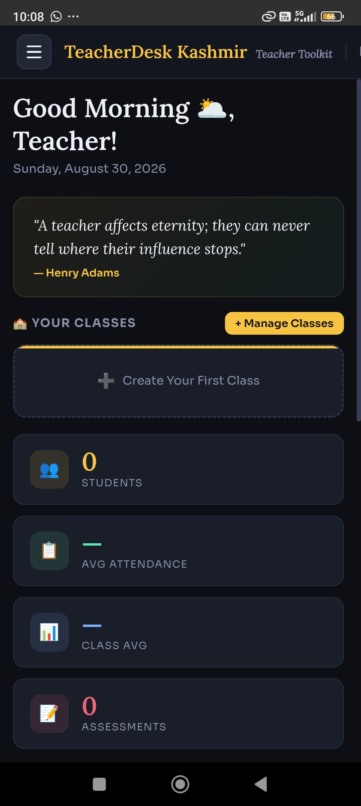
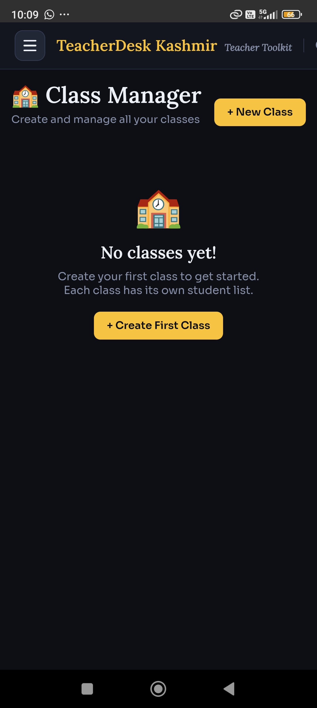
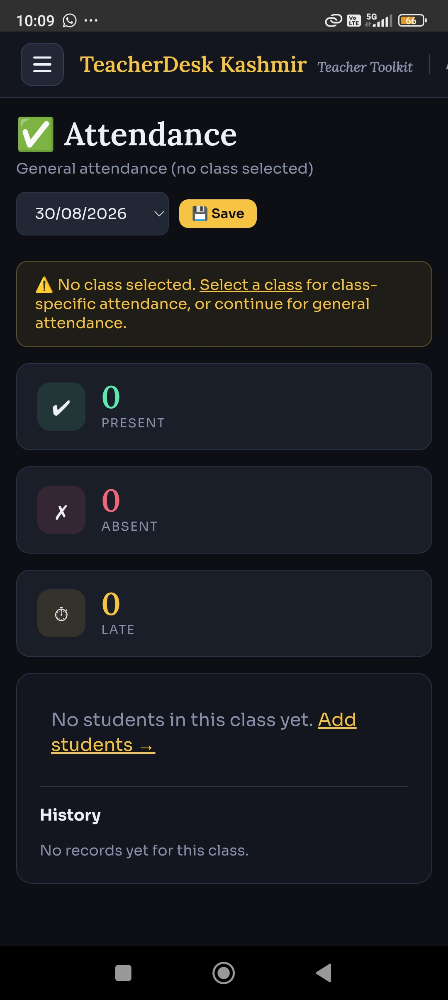
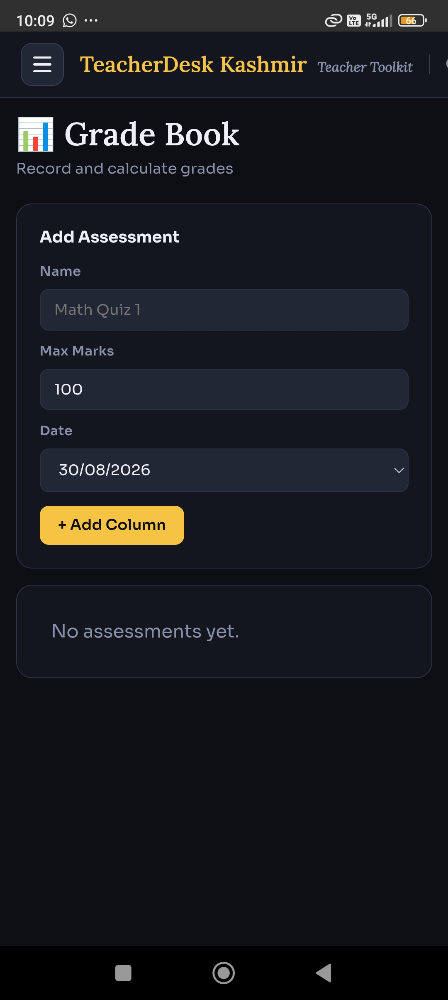
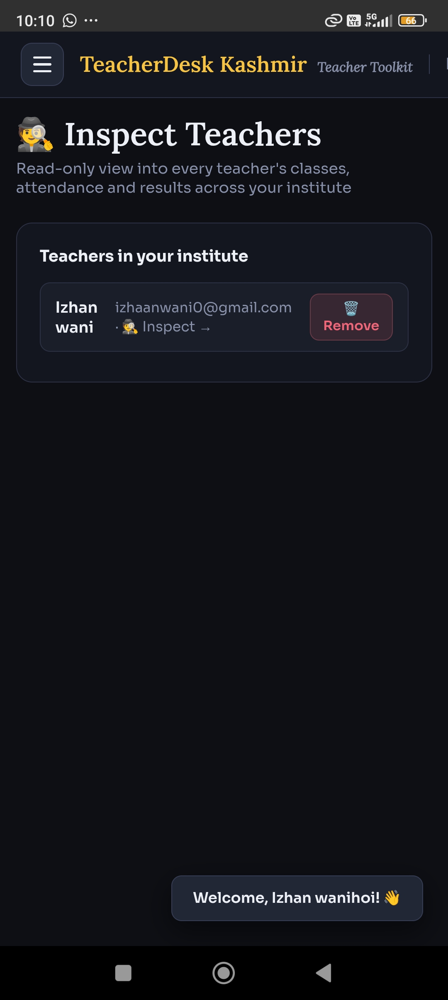
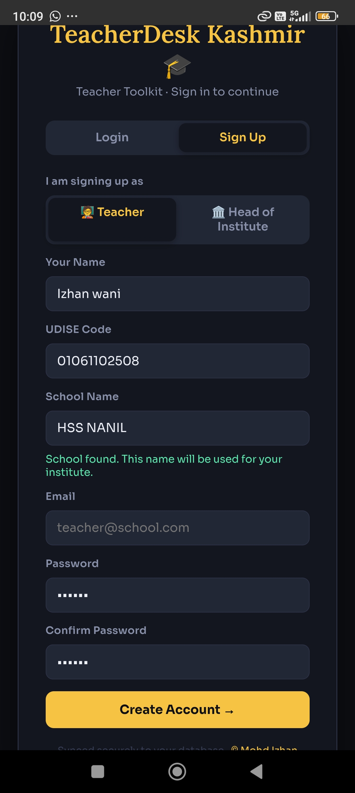

<div align="center">


# TeacherDesk Kashmir (TDK)

**A complete, database-backed teacher toolkit — built by a student, for real classrooms.**

[](https://ncert.nic.in)
[]()
[](#license)
[]()

</div>

---

## 📖 About

**TeacherDesk Kashmir (TDK)** is an all-in-one teacher productivity app built to solve a problem observed directly inside a real school — teachers spending hours every week on paperwork: attendance registers, mark sheets, lesson notes, and behavior logs.

TDK digitalises all of that into a single app that works on any phone, laptop, or classroom PC, backed by a real cloud database, so a teacher's data is never lost and is accessible from any device. It also ships with a nationwide **UDISE school-code database** built in, so any school in India can be looked up and auto-filled during signup instead of typing details by hand.

Built as a project entry for the **Rajya Stariya Bal Vaigyanik Pradarshani (RSBVP)** — the State-Level Children's Science Exhibition organised by NCERT, Government of India — under the theme **"STEM for Viksit and Atmanirbhar Bharat."**

> Developed entirely by **Mohd Izhan Wani**, a student at **GMHSS Nanil** — no team, no budget, just classroom problems solved with code.

---

## 🖼️ Screenshots

<div align="center">


<p><em>Dashboard — daily overview of classes, attendance, and quick stats</em></p>


<p><em>Class Manager — create classes, manage students, switch active class</em></p>


<p><em>Attendance — time-stamped daily marking</em></p>


<p><em>Grade Book — assessments and results per class</em></p>


<p><em>Head of Institute view — inspect any teacher's classes, attendance & results across the school</em></p>


<p><em>Signup — school auto-fills instantly from the built-in UDISE database</em></p>

</div>

---

## ✨ Features

| Category | Tools |
|---|---|
| **Daily Tools** | Attendance (with time-stamped marking), Random Picker, Timetable, Seating Chart, Class Timer |
| **Assessment** | Grade Book, Quiz Maker, Test Paper Generator, Performance Analytics |
| **Students** | Yearly Result (tap a student → full-year attendance + academic report), Behavior Tracker, Homework Tracker |
| **Planning** | Lesson Plans, Report Cards, Announcements, Certificates, Quick Notes |
| **Extras** | Class Polls, Resource Library, Student Profiles, Class Comparison, Daily Summary |
| **More Tools** | Syllabus Tracker, Marks → Grade Converter, Exit Tickets, Class Calendar |
| **School Directory** | Built-in UDISE database covering schools across India — auto-fills school details on signup |
| **Admin** | **Head of Institute** role — remove teachers, edit or reassign any classroom, and inspect any teacher's classes, students, attendance %, and results across the institute; export any teacher's full report as a standalone HTML file |

---

## 🏗️ Tech Stack

- **Frontend:** Single-file HTML/CSS/vanilla JavaScript — no build step, works offline-first
- **Backend:** Cloud Postgres database with authentication and row-level security, so every teacher's data stays private to them and their institute
- **Roles:** Two account types — `teacher` and `head` (Head of Institute)
- **Data model:** Relational tables for classes, students, attendance, assessments, grades, and a nationwide school directory (UDISE codes); a flexible JSON store for the rest (timetable, homework, quiz bank, resources, etc.)

---

## 🔐 Roles

- **Teacher** — manages their own classes, students, attendance, grades, and every daily tool. Data is private to them.
- **Head of Institute** — signs up once per institute, lands on the **Inspect** dashboard, and can view every teacher's classes, student roster, attendance %, and result averages; edit or reassign classrooms; remove teachers; and export any teacher's full report as an HTML file.

---

## 📂 Repo Contents

```
index.html            → the full app (rename freely, e.g. TEACHERDESKOFF.html)
tdk-logo-512.png       → app icon / logo
screenshot-*.png       → screenshots shown above
```

---

## 🛡️ License

Copyright © 2025 **Mohd Izhan Wani**. All rights reserved.

TeacherDesk Kashmir — including its design, source code, layout, features, logic, and overall concept — is the sole original work of Mohd Izhan Wani. All data entered into TDK belongs exclusively to the user and is stored only in their own database.

---

<div align="center">
<sub>Built with ❤️ by Mohd Izhan Wani · GMHSS Nanil · RSBVP Project</sub>
</div>
